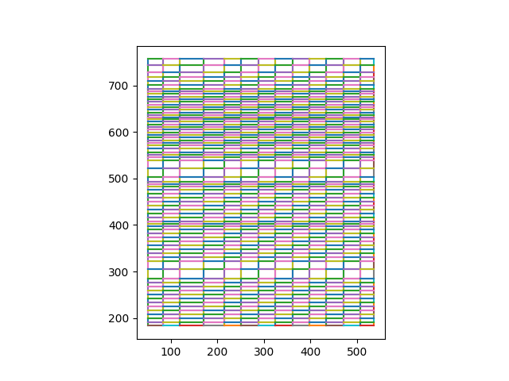
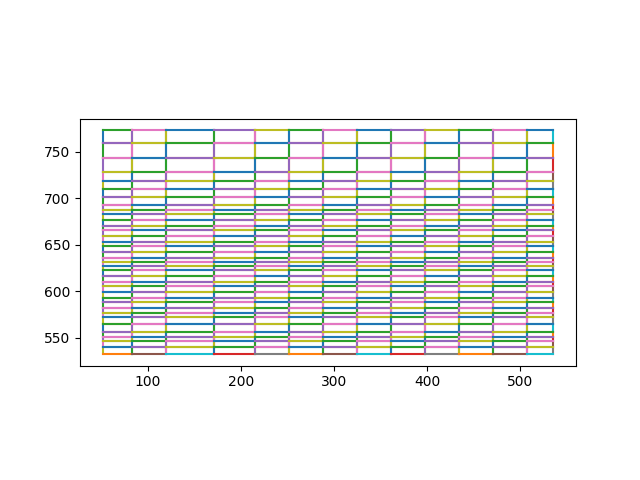
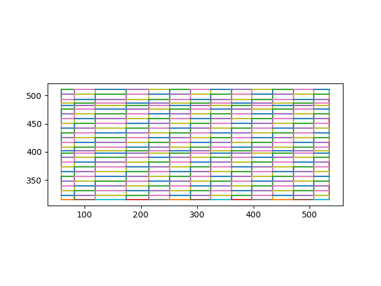
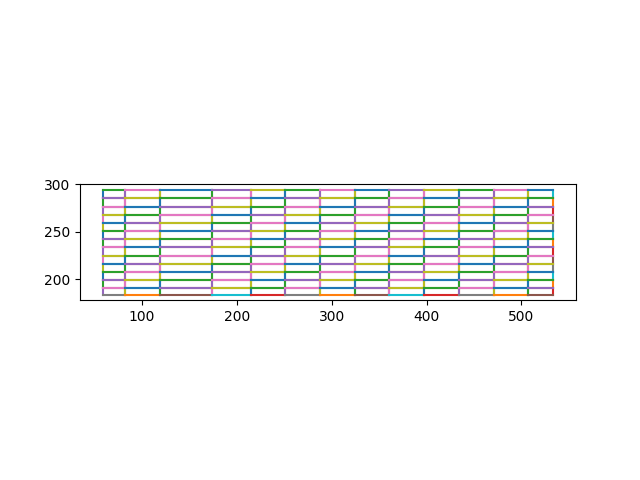

# Post codes against Zone, Area, Location extracted from Parcel Force PDF

https://www.parcelforce.com/sites/default/files/UKPostcodelistv2Aug19.pdf

### Parcel Force PDF Input


### Excel Output


```shell
python cli.py ./input/UKPostcodelistv2Aug19.pdf ./output/output.csv
python cli.py ./input/UKPostcodelistv2Aug19.pdf ./output/output.xlsx
python cli.py ./input/UKPostcodelistv2Aug19.pdf ./output/output.json
```

Page 7 is the troublesome page as it has 3 zones. Using Camelot cli we can get the table co-ordinates and extract them
individually for processing.

### Show page grid
```shell
camelot --pages 7 stream -plot grid ./input/UKPostcodelistv2Aug19.pdf
```



### Page 7, Zone 1 Grid
```shell
camelot --pages 7 stream -plot grid -T 40,770,537,537 ./input/UKPostcodelistv2Aug19.pdf
```



###  Page 7, Zone 2 Grid
```shell
camelot --pages 7 stream -plot grid -T 40,510,537,320 ./input/UKPostcodelistv2Aug19.pdf
```



### Page 7, Zone 3 Grid
```shell
camelot --pages 7 stream -plot grid -T 40,290,537,180 ./input/UKPostcodelistv2Aug19.pdf
```


